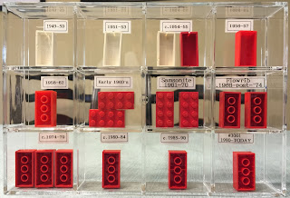

# Procesverslag

Jaa, je raad het al! Ik ga aan de slag met de evolutie van LEGO!

## Wie ben ik

### Ontwerper:
Eva Zaadnoorijk student CMD | November 2022 | Minor VID | 500847567

#### Mijn startniveau:
Mijn startniveau is Rood

# Mijn plan

  
De eerste versie/schets van mijn ontwerp & mijn persoonlijke uitdaging

  ### De eerste versie/schets:
  

  ### Mijn ambitie: 
  Aan deze technieken/punten wil ik werken:
  - Nieuwe CSS leren
  - "Nette" CSS schrijven
  - Animaties maken
 

## Voortgang/Feedback 1

**Idee 1:**

- leuk idee oppassen met achtergrond niet met die nopjes, die wolk kan je er zo niet opklikken, het is technisch niet mogelijk.
- Bouwinstructies wolk planten en voorwerpen opzoeken, kijk goed naar bekende blokjes.
- Stapjes goed prima, toont voorgang/ tijdlijn. Laat veel verschil zien in thema's en voorwerpen.
- Kijk naar stopmotion animaties voor poppetjes wordt veel gebruikt voor lego op youtube.
- Oppassen met kleurgebruik te veel kleuren dat leidt af. Misschien een thema een set gebruiken als inspiratie.
- ... idee speelgoedplankje met lego sets toont voortgang.

  
Mijn bevindingen + wijzigingen (minimaal 5)

  ### Bevinding 1:
  De wolk in mijn schets klopt niet met de achtergrond.

  #### oplossing:
  Ik denk dat ik de wolk achterwege ga laten omdat die ivm de achtergrond niet zo zal passen. Hij kan namelijk technisch gezien zo niet om de cahtergrond klikken

  ### Bevinding 2:
  Veel verschil laten zien tussen de poppetjes.

  #### oplossing:
  Veel verschillen laten zien in de poppetjes. Ik ga veel verschillende soorten poppetjes namaken met CSS zodat de veranderen beter te zien zijn. Ik heb hiervoor een tijdlijn gevonden met de verandering van lego poppetjes en een tijdlijn met de verandering van de blokjes.

  
  (The Brothers Brick, 2018)

  
  (Quatrain, 2022)

  ### Bevinding 3:
  Uitkijken met het kleurgebruik. Niet te veel kleuren door elkaar gaan gebruiken, dit leid erg af en zo wordt het ook nog eens onoverzichtelijk.

  #### oplossing:
  Ik maak een slectie van kleuren die ik wil gebruiken. Hiervoor ga ik opzoek naar kleuren die specifiek in Lego worden gebruikt. Daarvoor heb ik hetvolgende schema gevonden.

  
  (Crowther, 2022)

## Voortgang/Feedback 2

- Niet alles kan nog met tab worden geopent of worden geselecteerd.
- Kijk nog even naar de states van de interactieve elementen, deze passen er nog niet helemaal bij.
- Werk aan de netheid van je HTML en CSS deze kan nog netter worden ingesprongen en maak gebruik van meer witruimte.
- Zorg voor codecomments in je HTML en CSS dit maakt het al snel overzichtelijker.
- Neem je bronnen op in je code

  
Mijn bevindingen + wijzigingen (minimaal 5)

  
  ### Bevinding 1:
  Doordat niet alles nog met tab kan worden geslecteerd, is het niet geheel toegangkelijk.

  #### oplossing:
  Ik heb dit opgelost door een button te maken van al mijn poppetjes en door al mijn articles een tabindex van 0 te geven. Zo kunnen ook deze worden geselecteerd.

  ### Bevinding 2:
  De states van interactieve elementen kan worden verbeterd.

  #### oplossing:
  Ik heb dit verbeterd door veel meer states toe te voegen aan verschillende elementen. Deze states passen bij het element zelf.

  ### Bevinding 3:
  Voeg codecomments toe voor duidelijkheid, bronnen maar ook om het overzichtelijker te maken in je code.

  #### oplossing:
  Ik heb bij elk element in mijn css een codecomment toegevoegd die zegt welk element het is. Hierdoor kan ik makkelijker stylen met CSS en alles beter terugvinden. In mijn HTML heb ik hetzelfde gedaan en ik heb hier bronnen toegevoegd in mijn codecomments.

## Voortgang/Feedback 3

- Per poppetje een andere animatie maken.
- Informatie over poppetjes goed neerzetten.
- Je kan je muis misschien nog aanpassen
- De poppetjes wat meer laten bewegen zorgt voor meer interactie.

  
Mijn bevindingen + wijzigingen (minimaal 5)

  
  
  ### Bevinding 1:
  Animatie moet wel bij het poppetje passen.

  #### oplossing:
  Ik heb de states en click-events per poppetje anders gemaakt. Hierdoor is het heel divers en niet te statisch.

  ### Bevinding 2:
  Muis kunnen aanpassen op basis van lego.

  #### oplossing:
  Ik heb van mijn cursor een lego icon gemaakt. Deze veranderd ook met light en darkmode mee om hem zo beter zichtbaar te maken.

  ### Bevinding 3:
  Informatie over de poppetjes geven en dit beter laten zien/ neerzetten.

  #### oplossing:
  Ik heb meer onderzoek gedaan naar de poppetjes en de blokjes  . Deze informatie heb ik kort en bondig beschreven in de lego poppetjes naast de karakters. Omdat dit vrij veel tekst was heb ik de blokjes laten vergroten zodat dit beter leesbaar is.

## Reflectie

  
Mijn eindresultaat & persoonlijke ontwikkeling

  ### Je uitkomst - karakteristiek screenshot(s):

  

  Mijn eindresultaat is een lego trap die verschillende interactieve elementen bevat die ieder hun eigen vormgeveingen interactie hebben.

  ### Dit ging goed/Heb ik geleerd: 

  

  Ik heb veel geleerd om gradients te gebruiken en hoe ik deze kan toepassen. Dit zie je terug bijvoorbeeld in de baard van de tovenaar. De achtergrondafbeedling bestaat uit een linear gradient. Ook heb ik geleerd om elementen vorm te geven (poppetjes) te maken in CSS met als doel geen afbeeldingen te gebruiken.

  ### Dit was lastig/Is niet gelukt:

  Het animaren van de poppetjes bleef vrij lastig voor sommige. Ik kan ze op en neer laten bewegen en heen en weer. Maar ik had graag nog meer kunnen willen doen.

  

## Bronnenlijst

continu bijhouden terwijl je werkt

Nb. Wees specifiek ('css-tricks' als bron is bijv. niet specifiek genoeg).

1. Fonts, 1. (z.d.). Fredoka Font Family ·. 1001 Fonts. Geraadpleegd op 1 november 2022, van https://www.1001fonts.com/fredoka-one-font.html 
2. Ingthorsson, S. (z.d.). CSS DOuble Text Stroke. codepen. Geraadpleegd op 1 november 2022, van https://codepen.io/ingthorsson/pen/QVRVZP?editors=1100
3. Icons. (z.d.). Skull crossbones Icons Download for Free in PNG and SVG. Geraadpleegd op 8 november 2022, van https://icons8.com/icons/set/skull-crossbones
4. Crawforty. (z.d.). LEGO Captain Redbeard Minifigure. Geraadpleegd op 8 november 2022, van https://www.crawforty.xyz/ProductDetail.aspx?iid=171370287&pr=42.88
5. LEGO Yoda Head (41880) | Brick Owl - LEGO Marketplace. (z.d.). Brick Owl. Geraadpleegd op 9 november 2022, van https://www.brickowl.com/catalog/lego-yoda-head-41880 
6. Bricklink. (z.d.). BrickLink Reference Catalog - Large Image of Minifigure sw0051. Geraadpleegd op 10 november 2022, van https://www.bricklink.com/catalogItemPic.asp?M=sw0051
7. Crowther, J. (2022, 25 januari). All the Current LEGO Colors HEX and RGB Codes. Jenny’s Crayon Collection. http://www.jennyscrayoncollection.com/2021/06/all-current-lego-colors.html 
8. The Brothers Brick. (2018, 31 augustus). LEGO Minifigure 40 Years Infographic. https://www.brothers-brick.com/2018/08/31/the-minifigure-turns-40-a-colorful-history/lego-minifigure-40-years-infographic/
9. Quatrain, S. (2022, 10 november). A Short History of the LEGO Brick (1949-Today) PART ONE. http://snakeandboris.blogspot.com/2016/06/a-short-history-of-lego-brick-1949.html
10. Lego brick Icons“ Download for Free in PNG and SVG. (z.d.). Geraadpleegd op 10 november 2022, van https://icons8.com/icons/set/lego-brick 
11. LEGO® History - LEGO.com US. (z.d.). https://www.lego.com/en-us/history/

